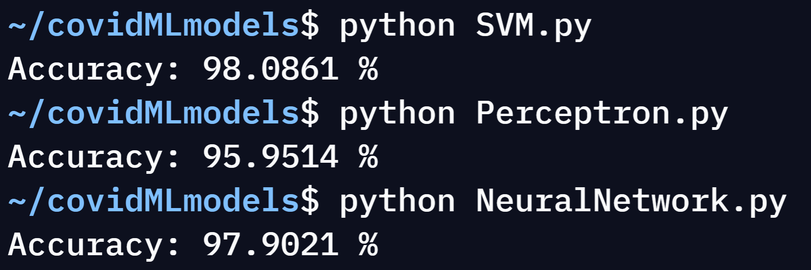

# covidML
A React web app that uses machine learning models to predict whether or not you have COVID-19.

covidML consists of 3 parts-
- The machine learning models.
- The API.
- The frontend UI.

## The Machine Learning Models
The Machine Learning Models are programmed in _Python_ using the _scikit-learn_ library. There are 3 models: _a Perceptron, a Support Vector Machine (SVM) and a Multilayer Perceptron (a type of Artificial Neural Network)_. The models were trained using the dataset and were then saved using the _joblib_ library. The dataset was taken from the following link: _https://www.kaggle.com/hemanthhari/symptoms-and-covid-presence?select=Covid+Dataset.csv_.

The models had the following accuracies when the dataset was shuffled, the models were trained using half of the dataset and then tested using the other half:

__The code for the Machine Learning Models is located in the 'models' file of this repository.__

## The API
The API was programmed using in _Python_ using the _Flask_ framework. To send a request to API, the answers to the survey should be appended to the URL and be seperated by commas (1s should be used to represent yes answers and 0s should be used to represent no answers). The API then uses the machine learning models to predict whether or not the person has COVID-19 and returns the data in a JSON-format.

__The code for the API is located in the 'API' folder of this repository.__

## The frontend UI
The frontend UI was programmed using the _React_ framework. Once the user has completed the survey using the frontend, a request is sent to the API and the data returned is then displayed on the frontend. 

__The code for the frontend UI is located in the 'UI' folder of this repository.__

## Additional Information
The entire project is hosted using repl.it (this includes both the API and the frontend). Since repl.it shuts down web servers after a while of inactivity, I used Uptime Robot to repeatedly send requests to both the API and the frontend to make sure they don't shut down due to inactivity.

## How to access the site
To access the site simply visit the frontend at: https://covidml.absarsy17.repl.co/. Then answer the survey and wait for the results to load.
